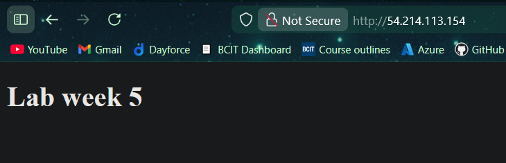
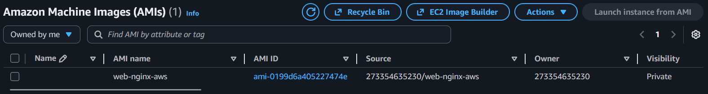

# 4640-in-class-wk5

## Team

- Misha Makaroff
- Angad Bains

## Visiting Our NGINX Instance





## Steps Taken

- We defined the image source in a build block

```bash
build {
  name = "web-nginx"
  sources = [
    # COMPLETE ME Use the source defined above
    "sources.amazon-ebs.debian"
  ]
```

- We used a shell provisioner to run commands to create folders and set permissions on them

```hcl
  provisioner "shell" {
    inline = [
      "echo creating directories",
      # COMPLETE ME add inline scripts to create necessary directories and change directory ownership.
      # See nginx.conf file for root directory where files will be served.
      # Files need appropriate ownership for default user
      "sudo mkdir -p /web/html /tmp/web",
      "sudo chown admin /web/html /tmp/web"
    ]
  }
```

- We used two file provisioners to upload our NGINX configuration and website index files.

```hcl
  provisioner "file" {
    # COMPLETE ME add the HTML file to your image
    source      = "files/index.html"
    destination = "/web/html/index.html"
  }
```

```hcl
  provisioner "file" {
    # COMPLETE ME add the nginx.conf file to your image
    source      = "files/nginx.conf"
    destination = "/tmp/web/nginx.conf"
  }
```

- We used a shell provisioner to specify the two scripts to upload and run (NGINX installation and configuration scripts)

```hcl
  provisioner "shell" {
    scripts = [
      "scripts/install-nginx",
      "scripts/setup-nginx"
    ]
  }
```

## References

1. [Build Block Syntax](https://developer.hashicorp.com/packer/docs/templates/hcl_templates/blocks/build)
2. [Provisioner Syntax](https://developer.hashicorp.com/packer/docs/templates/hcl_templates/blocks/build/provisioner)
3. [Shell Provisioner Syntax](https://developer.hashicorp.com/packer/docs/provisioners/shell)
